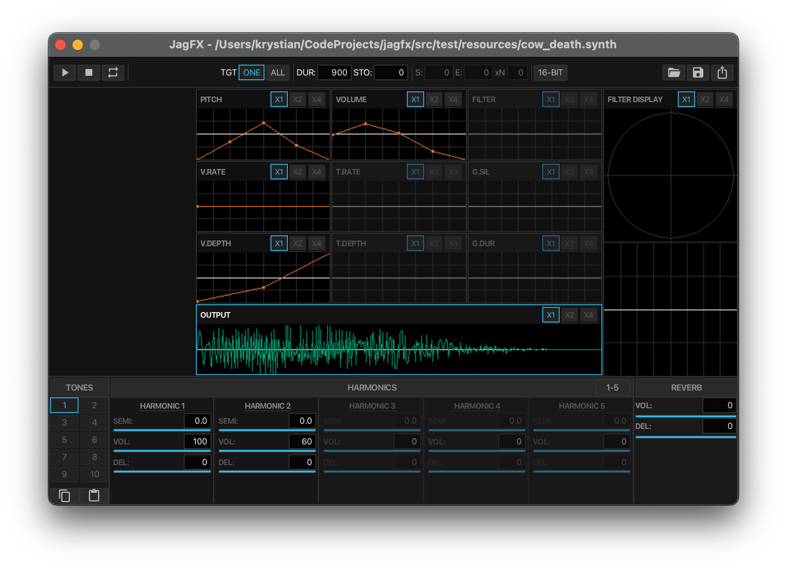

# JagFX - Jagex Additive Synthesizer

<p align="left">
  
</p>

Powerful tool for visualizing, playing, and converting Jagex Audio Synthesis (`.synth`) files.

## Features

- **Audio Engine**: High-performance additive synthesis with FM modulation, gating, and custom IIR filters.
- **Visualizations**: Real-time waveform rendering, pole-zero plots, and envelope editors.
- **Cross-Platform**: Runs on macOS, Windows, and Linux.
- **Batch Processing**: CLI tools for rapid `.synth` to `.wav` conversion.

---

## Prerequisites

- **JDK 21** or higher.
- **sbt 1.11+** (Scala Build Tool).
- **Node.js** (or `bun`) for compiling SCSS styles.

---

## Getting Started

### 1. Build & Run

```bash
# compile and run GUI
sbt compile && sbt run

# run unit tests
sbt test
```

### 2. CLI Usage

Batch convert files without opening GUI:

```bash
# sbt "cli <input.synth> <output.wav> [loopCount]"

# convert single file
sbt "cli input.synth output.wav"

# convert and loop 4 times
sbt "cli input.synth output_looped.wav 4"
```

---

## Building for Distribution

JagFX supports two primary distribution methods:

### Option A: Cross-Platform "Fat JAR" (Recommended)

Creates single `.jar` file containing **all** JavaFX natives (Windows, Linux, macOS Intel/Silicon). Useful for sharing single file that works anywhere JVM is installed.

```bash
sbt fatJar
```

_Output: `target/scala-3.7.4/jagfx-all-platforms-0.2.0-SNAPSHOT.jar`_

### Option B: Native Application Bundle

Creates stripped-down, fast-compiled distribution for **current OS only**. Includes bundled JVM runtime, so user DOES NOT need Java installed.

```bash
sbt jlink
```

_Output: `target/jlink/jagfx/`_

---

## Project Structure

```text
src/main/
├── scala/jagfx/
│   ├── io/                 # Binary .synth reader/writer
│   ├── model/              # Pure data models (Tones, Envelopes)
│   ├── synth/              # Core DSP engine (Oscillators, Filters)
│   ├── ui/                 # JavaFX views & controllers
│   ├── utils/              # Utility functions
│   ├── JagFX.scala         # GUI Entry point
│   └── JagFXCli.scala      # CLI Entry point
└── scss/                   # UI Styling
```

## Community Examples

### `ice_cast.synth` and `ice_barrage_impact.synth`

<https://github.com/user-attachments/assets/fff9dba4-0acb-4ca9-949e-b593fdbbc0fc>

## License

This project is licensed under MIT License. See `LICENSE` file for more details.
